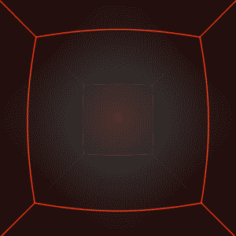
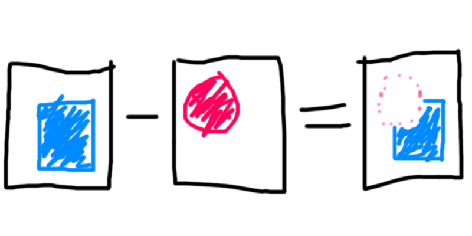

# Everyday One Motion - 20160317  

"max( IFS Parallelotope, -Box )"  

  

JavaScript, WebGL, Raymarching  

[Everyday One Motion](http://motions.work/motion/153)  
[Demo Page](http://fms-cat-eom.github.io/20160317)  

## max( IFS Parallelotope, -Box )  

[前回](https://github.com/fms-cat-eom/20160310)の続きです。[ Type ]の中では、前回のIFSからさらに直方体を引き算した図形を用いています。  
そこで今回のGIFでは、IFSから直方体を引き算したものを扱いました。  
IFS単体だと、図形の内側が全部埋まってしまってひどい絵になってしまうことが多いので（なので前回のはめっちゃがんばってパラメータ選んでます）、内側をくり抜くことで対処をしています。  
このとき、副作用的に壁面にかっこいい図形が出てきてラッキー✌✌✌✌、という感じです。  

## 引き算

数の引き算は簡単に想起できるでしょう。例えば `3 - 2 = 1` などです。カンタンですね。  
引き算は数字同士だけではなく、ベクトルや行列、それに集合や図形などでも定義することができます。  

### 集合の引き算

図形において定義されている引き算（のうちもっともメジャーなもの）は、集合におけるそれと似ています。  
集合における引き算はこんな感じです。  
```
A = { たこ, ピザ, もやし, タコス }
B = { ピザ, おすし, タコス, ラーメン }
A - B = { たこ, もやし }
B - A = { おすし, ラーメン }
```
A を 好きな食べ物 、  
B を 料理 と言い換えれば、  
A - B が 好きな食べ物のうち料理でないもの 、  
B - A が 料理のうち好きでもないもの と言い換えることができます。わかりやすい〜！🍕🍣🌮🍜  

### 図形の引き算

図形の引き算は…図で理解してもらうのが一番ラクですね。こんな感じです。  
四角形から円を引き算した場合、四角形から円をくり抜いて取った感じの図形ができあがります。  
  
※図は不正確です。  

2次元の図で説明しましたが、3次元でも同じようにくり抜く感じでできます。  

## max

レイマーチングで図形の引き算を実現するには、max関数を使います。  
max関数は、ふたつの数値のうち大きいものを返す関数ですね。  
例えば、立方体から球体を引きたい場合はこんな感じです。  
```GLSL
float distBox = box( rayPos, vec3( 1.0 ) );
float distSphere = sphere( rayPos, 1.5 );
float dist = max( distBox, -distSphere );
```

参考URL: http://iquilezles.org/www/articles/distfunctions/distfunctions.htm
